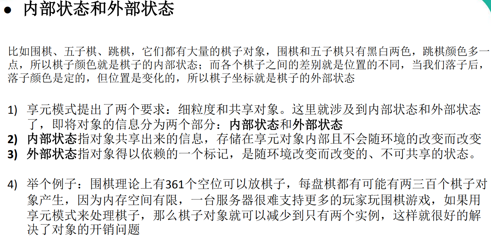

## 一、设计模式常用原则

1.单一职责原则

2.接口隔离原则

3.依赖倒转（倒置）原则

4.里氏替换原则

5.开闭原则

6.迪米特法则

7.合成复用原则


### 1.单一职责原则

​		对类来说，即一个类应该只负责一项职责。

​		降低类的复杂度，一个类只负责一项职责

​		提高类的可读性，可维护性

​		降低变更引起的风险

​		通常情况下，应当准守单一职责原则，只有逻辑够简单，才可以在代码级违反单一职责原则；只有类中方法数量足够少，可以在方法级别保持单一职责原则

如下举例：

（1）

```java
package com.company.principle.singleresponsibility;

/**
 * @program: atguiguDesignPattrn
 * @author: wangjinpeng
 * @create: 2020-05-25 10:18
 * @description: 单一原则
 **/
public class SingleResponsibility1 {
    public static void main(String[] args) {
        Vehicle vehicle = new Vehicle();
        vehicle.run("汽车");
        vehicle.run("飞机");
        vehicle.run("轮船");

    }
}


class Vehicle {

    public void run(String name){
        System.out.println(name+"run");
    }

}

```

```java
汽车run
飞机run
轮船run
```

从设计上来说违反了单一职责原则，如有需要，因根据交通工具的业务类型才分成多个类，来分别实现各交通工具的run方法。


（2）

```java
package com.company.principle.singleresponsibility;

/**
 * @program: atguiguDesignPattrn
 * @author: wangjinpeng
 * @create: 2020-05-25 14:15
 * @description: SingleResponsibility2
 **/
public class SingleResponsibility2 {
    public static void main(String[] args) {
        AirVehicle airVehicle = new AirVehicle();
        airVehicle.run("飞机");

        WaterVehicle waterVehicle = new WaterVehicle();
        waterVehicle.run("轮船");

        RoadVehicle roadVehicle = new RoadVehicle();
        roadVehicle.run("汽车");

    }

}

class AirVehicle{
    public void run(String name){
        System.out.println("air:"+name);
    }
}

class WaterVehicle{
    public void run(String name){
        System.out.println("water:"+name);
    }
}

class RoadVehicle{
    public void run(String name){
        System.out.println("road:"+name);
    }
}
```

```
air:飞机
water:轮船
road:汽车
```

在类的层次满足单一职责原则，但是成本太高，涉及改动的地方比较多。

（3）

```java
package com.company.principle.singleresponsibility;

/**
 * @program: atguiguDesignPattrn
 * @author: wangjinpeng
 * @create: 2020-05-25 14:15
 * @description: SingleResponsibility3
 **/
public class SingleResponsibility3 {
    public static void main(String[] args) {
        VehicleClass vehicleClass = new VehicleClass();
        vehicleClass.airRun("飞机");
        vehicleClass.roadRun("汽车");
        vehicleClass.waterRun("");
    }

}

class VehicleClass {

    public void airRun(String name){
        System.out.println("air:run"+name);
    }

    public void roadRun(String name){
        System.out.println("road:run"+name);
    }

    public void waterRun(String name){
        System.out.println("water:run"+name);
    }
}

```

```java
air:run飞机
road:run汽车
water:run
```

保存现有类的结构，在方法上做改动，舍去了类的单一职责原则，准守方法的单一职责原则。


## 二、设计模式类型

### 1.模式分类

（1）*创建型模式*：单例模式、抽象工厂模式、原型模式、建造者模式、工厂模式。（5种）

（2）*结构型模式*：适配器模式、桥接模式、装饰模式、组合模式、外观模式、亨元模式、代理模式。（7种）

（3）*行为型模式*：模板方法模式、命令模式、访问者模式、迭代者模式、观察者模式、中介者模式、备忘录模式、解释器模式（Interpreter模式）、状态模式、策略模式、职责链模式（责任链模式）。（11种）


### 2.设计模式详解

### （1）单例模式

​		单例设计模式：采取一定的方法保证在整个软件的系统中，对某个*类*会只能存在*一个对象实例*。

​		单例设计模式有八种写法：

​		1）***饿汉式（静态变量）***

​		2）***饿汉式（静态代码块）***

​		3）懒汉式（线程不安全）

​		4）懒汉式（线程安全，同步方法）

​		5）懒汉式（线程安全，同步代码块）

​		6）***双重检查***     推荐使用

​		7）***静态内部类***   推荐使用

​		8）***枚举***    推荐使用


##### ***饿汉式（静态变量）***

步骤如下：

1）构造器私有化

2）类的内部创建对象

3）向外暴露一个静态的公共方法

4）代码实现

```java
package com.company.pattern.singleton;

/**
 * @program: atguiguDesignPattrn
 * @author: wangjinpeng
 * @create: 2020-05-25 21:26
 * @description: 静态变类
 **/
public class SingletonTest01 {
    public static void main(String[] args) {
        Singleton instance = Singleton.getInstance();
        Singleton instance1 = Singleton.getInstance();
        System.out.println(instance==instance1);

        System.out.println(instance+":"+instance.hashCode());
        System.out.println(instance1+":"+instance1.hashCode());
    }
}

//饿汉式（静态变量）
class Singleton{

    //私有化构造函数
    private Singleton(){

    }

    //设置静态对象
    private static final Singleton INSTANCE  = new Singleton();

    // 提供对外的使用方法
    public static Singleton getInstance(){
        return INSTANCE;
    }
}

```

```java
true
com.company.pattern.singleton.Singleton@1b6d3586:460141958
com.company.pattern.singleton.Singleton@1b6d3586:460141958
```

-1592053427804.jpg)


##### ***饿汉式（静态代码块）***

```java
package com.company.pattern.singleton;

/**
 * @program: atguiguDesignPattrn
 * @author: wangjinpeng
 * @create: 2020-05-25 21:56
 * @description: 静态代码块
 **/
public class SingletonTest02 {
    public static void main(String[] args) {
        Singleton02 instance = Singleton02.getInstance();
        Singleton02 instance1 = Singleton02.getInstance();
        System.out.println(instance == instance1);
        System.out.println("instance:"+instance.hashCode());
        System.out.println("instance1:"+instance1.hashCode());
    }
}


class Singleton02 {

    private Singleton02() {

    }

    private static Singleton02 INSTANCE;

    static {
        INSTANCE = new Singleton02();
    }

    public static Singleton02 getInstance() {
        return INSTANCE;
    }
}

```

```java
true
instance:460141958
instance1:460141958
```

.jpg)


##### ***懒汉式（线程不安全）***

```java
package com.company.pattern.singleton;

/**
 * @program: atguiguDesignPattrn
 * @author: wangjinpeng
 * @create: 2020-05-25 22:09
 * @description: 懒汉式线程不安全
 **/
public class SingletonTest03 {
    public static void main(String[] args) {
        Singleton03 instance = Singleton03.getInstance();
        Singleton03 instance1 = Singleton03.getInstance();
        System.out.println(instance == instance1);
        System.out.println("instance:" + instance.hashCode());
        System.out.println("instance1:" + instance1.hashCode());
    }
}


class Singleton03 {

    private Singleton03() {
    }

    private static Singleton03 instance;

    public static Singleton03 getInstance() {
        //以下代码存在问题
        //当在多线程环境下，一条线程通过了 if (instance == null)的判断，但还未开始执行 instance = new Singleton03()的时候
        //另一条线程此时也通过了 if (instance == null)的判断，则会导致 instance = new Singleton03() 会被重复执行
        if (instance == null) {
            instance = new Singleton03();
        }
        return instance;
    }
}
```


.jpg)


##### ***懒汉式（线程安全，同步方法）***

```java
package com.company.pattern.singleton;

/**
 * @program: atguiguDesignPattrn
 * @author: wangjinpeng
 * @create: 2020-05-27 11:36
 * @description: 懒汉式线程安全
 **/
public class SingletonTest04 {

    private SingletonTest04(){}

    private static SingletonTest04 INSTACNE;

    // synchronized 对方加锁
    public static synchronized SingletonTest04 getInstance(){
        if (INSTACNE==null){
            INSTACNE = new SingletonTest04();
        }
        return INSTACNE;

    }


    public static void main(String[] args) {
        SingletonTest04 instance = SingletonTest04.getInstance();
        SingletonTest04 instance1 = SingletonTest04.getInstance();
        System.out.println(instance==instance1);

    }
}

```


.jpg)


##### ***懒汉式（线程不安全，同步代码块）***

```java 
package com.company.pattern.singleton;

/**
 * @program: atguiguDesignPattrn
 * @author: wangjinpeng
 * @create: 2020-05-27 15:30
 * @description: 懒汉式、线程安全、同步代码块
 **/
public class SingletonTest05 {
    private SingletonTest05(){}

    private static SingletonTest05 INSTANCE;

    private static SingletonTest05 getInstance(){
        if (INSTANCE == null){
            //同步代码块
            synchronized (SingletonTest05.class){
                INSTANCE = new SingletonTest05();
            }
        }
        return INSTANCE;
    }
}

```

.jpg)


##### ***双重检查***

```java
package com.company.pattern.singleton;

/**
 * @program: atguiguDesignPattrn
 * @author: wangjinpeng
 * @create: 2020-05-27 15:43
 * @description: 双重检查
 **/
public class SingletonTest06 {

    private SingletonTest06(){}

    private static volatile SingletonTest06 INSTANCE;

    public static SingletonTest06 getInstance(){
        if(INSTANCE ==null){
            synchronized (SingletonTest06.class){
                if(INSTANCE ==null){
                    INSTANCE = new SingletonTest06();
                }
            }
        }
        return INSTANCE;
    }
}

```


##### ***静态内部类***

```java
package com.company.pattern.singleton;

/**
 * @program: atguiguDesignPattrn
 * @author: wangjinpeng
 * @create: 2020-05-27 16:34
 * @description: 静态内部类
 **/
public class SingletonTest07 {

    private SingletonTest07(){}

    private static class SingletonInnerClass{
        private static final SingletonTest07 single = new SingletonTest07();
    }

    public static SingletonTest07 getInstance(){
        return SingletonInnerClass.single;
    }
}
```


***枚举***

```java
package com.company.pattern.singleton;

/**
 * @program: atguiguDesignPattrn
 * @author: wangjinpeng
 * @create: 2020-05-27 21:36
 * @description: 枚举
 **/
public class SingletonTest08 {
    public static void main(String[] args) {
        SingletonEnum instance = SingletonEnum.INSTANCE;
        SingletonEnum instance1 = SingletonEnum.INSTANCE;
        System.out.println(instance==instance1);
        System.out.println("instance:"+instance.hashCode());
        System.out.println("instance1:"+instance1.hashCode());
    }
}


enum SingletonEnum{
    INSTANCE;
    public void sayOK(){
        System.out.println("ok~");
    }
}

```

```java
true
instance:460141958
instance1:460141958
```


### （2）工厂模式

传统方法：


抽象父类 Pizza

```java
package com.company.pattern.factory.simplefactory.pizzastore.pizza;

/**
 * @program: atguiguDesignPattrn
 * @author: wangjinpeng
 * @create: 2020-05-28 19:44
 * @description: Pizza
 **/
public abstract class Pizza {

    protected  String name;

    //准备原材料
    public abstract void prepare();

    public void bake(){
        System.out.println(name+"baking");
    }

    public void cut(){
        System.out.println(name+"cutting");
    }

    public void box(){
        System.out.println(name+"boxing");
    }

    public String getName() {
        return name;
    }

    public void setName(String name) {
        this.name = name;
    }
}

```


CheesePizza

```java
package com.company.pattern.factory.simplefactory.pizzastore.pizza;

/**
 * @program: atguiguDesignPattrn
 * @author: wangjinpeng
 * @create: 2020-05-28 19:48
 * @description: CheesePizza
 **/
public class CheesePizza extends Pizza {
    @Override
    public void prepare() {
        System.out.println(" 准备制作Cheese");
    }
}

```


GreekPizza

```java
package com.company.pattern.factory.simplefactory.pizzastore.pizza;

/**
 * @program: atguiguDesignPattrn
 * @author: wangjinpeng
 * @create: 2020-05-28 19:49
 * @description: Greek
 **/
public class GreekPizza extends Pizza {
    @Override
    public void prepare() {
        System.out.println("准备希腊pizza");
    }
}
```


OrderPizza

```java 
package com.company.pattern.factory.simplefactory.pizzastore.order;

import com.company.pattern.factory.simplefactory.pizzastore.pizza.CheesePizza;
import com.company.pattern.factory.simplefactory.pizzastore.pizza.GreekPizza;
import com.company.pattern.factory.simplefactory.pizzastore.pizza.Pizza;

import java.io.BufferedReader;
import java.io.InputStreamReader;

/**
 * @program: atguiguDesignPattrn
 * @author: wangjinpeng
 * @create: 2020-05-28 19:53
 * @description: OrderPizza
 **/
public class OrderPizza {

    //构造器
    public OrderPizza() {
        Pizza pizza = null;
        String orderType;
        do{
            orderType = getType();
            if ("greek".equals(orderType)){
                    pizza = new GreekPizza();
                    pizza.setName(" Greekpizza");
            }else if("cheese".equals(orderType)){
                    pizza = new CheesePizza();
                    pizza.setName("Cheesepizza");
            }else{
                break;
            }
            //开始pizza的制作流程
            pizza.prepare();
            pizza.bake();
            pizza.cut();
            pizza.box();
        }while (true);
    }

    private String getType(){
        try {
            BufferedReader br = new BufferedReader(new InputStreamReader(System.in));
            System.out.println("print into type");
            String str = br.readLine();
            return str;
        }catch (Exception e){
            e.printStackTrace();
        }
        return "";
    }
}
```


PizzaStroe

```java 
package com.company.pattern.factory.simplefactory.pizzastore.order;

import com.company.pattern.factory.simplefactory.pizzastore.pizza.Pizza;

/**
 * @program: atguiguDesignPattrn
 * @author: wangjinpeng
 * @create: 2020-05-28 20:14
 * @description: PizzaOrder
 **/
public class PizzaStroe {
    public static void main(String[] args) {
        new OrderPizza();
    }
}
```

```java 
print into type
greek
准备希腊pizza
 Greekpizzabaking
 Greekpizzacutting
 Greekpizzaboxing
print into type
cheese
 准备制作Cheese
Cheesepizzabaking
Cheesepizzacutting
Cheesepizzaboxing
print into type
```


##### ***简单工厂***

以上类可复用


```java
package com.company.pattern.factory.simplefactory.pizzastore.simplefactory;

import com.company.pattern.factory.simplefactory.pizzastore.pizza.CheesePizza;
import com.company.pattern.factory.simplefactory.pizzastore.pizza.GreekPizza;
import com.company.pattern.factory.simplefactory.pizzastore.pizza.Pizza;

/**
 * @program: atguiguDesignPattrn
 * @author: wangjinpeng
 * @create: 2020-05-28 21:12
 * @description: SimpleFactory
 **/
public class SimpleFactory {

    public Pizza createPizza(String orderType){

        Pizza pizza = null;
        if ("greek".equals(orderType)){
            pizza = new GreekPizza();
            pizza.setName("greek 希腊");
        }else if ("cheese".equals(orderType)){
            pizza = new CheesePizza();
            pizza.setName("cheese 奶酪");
        }
        return pizza;
    }
}
```

创建一个简单的工厂，可根据使用者的需要提供相应的产品，后期有需要工厂里的产品类型需要新增。

```java
package com.company.pattern.factory.simplefactory.pizzastore.order;

import com.company.pattern.factory.simplefactory.pizzastore.pizza.CheesePizza;
import com.company.pattern.factory.simplefactory.pizzastore.pizza.GreekPizza;
import com.company.pattern.factory.simplefactory.pizzastore.pizza.Pizza;
import com.company.pattern.factory.simplefactory.pizzastore.simplefactory.SimpleFactory;

import java.io.BufferedReader;
import java.io.InputStreamReader;

/**
 * @program: atguiguDesignPattrn
 * @author: wangjinpeng
 * @create: 2020-05-28 19:53
 * @description: OrderPizza  类似一个中间人的操作
 **/
public class OrderPizza {

    public OrderPizza(SimpleFactory simpleFactory){
        //通过该类的构造方法
        setSimpleFactory(simpleFactory);
    }

    //定义一个简单工厂对象
    SimpleFactory simpleFactory;

    //通过该方法 指定工厂类型  及我需要什么工厂产出什么产品
    public void setSimpleFactory(SimpleFactory simpleFactory) {

        String orederType = "";//用户选择的
        this.simpleFactory = simpleFactory;
        do {
            orederType = getType();
            Pizza pizza = simpleFactory.createPizza(orederType);
            if (pizza !=null){
                    pizza.prepare();
                    pizza.bake();
                    pizza.cut();
                    pizza.box();
            }
            else
            {
                System.out.println("失败");
                break;
            }
        }while (true);
    }

    private String getType(){
        try {
            BufferedReader br = new BufferedReader(new InputStreamReader(System.in));
            System.out.println("print into type");
            String str = br.readLine();
            return str;
        }catch (Exception e){
            e.printStackTrace();
        }
        return "";
    }
}
```

可以简单理解OrderPizza为一个中间的操作，通过该类的指定行为来进一步点餐，通过用户的输入来指定具体的产品，进而通过产品工厂来生产产品，可以理解为将pizza的生产过程转移到了工厂中进行实现，调用者本身无需再继续关心pizza的生产过程中，只需要得到想要的产品即可+-。


##### ***工厂方法***

工厂方法模式定义了一个创建对象的接口，但由子类决定要实例化的类是哪一个，也就是说工厂方法模式让实例化推迟到子类。

还是以订购pizza为例，与上述举例存在的不同，该例中除了pizza类型外，还存在pizza的购买地点（北京，伦敦），故抽象出两个父类，

父类1，pizza：所有pizza的父类

父类2，pizzastore：所有订购店的父类

实现代码如下：


Pizza  (该类可以进一步提升到接口层次)

```java 
package com.company.pattern.factory.factorymethod.pizzastore.pizza;

/**
 * @program: atguiguDesignPattrn
 * @author: wangjinpeng
 * @create: 2020-05-29 20:07
 * @description: Pizza
 **/
public abstract class Pizza {

    protected  String name;
    //准备原材料
    public abstract void prepare();

    public void bake(){
        System.out.println(name+"baking");
    }

    public void cut(){
        System.out.println(name+"cutting");
    }

    public void box(){
        System.out.println(name+"boxing");
    }

    public String getName() {
        return name;
    }

    public void setName(String name) {
        this.name = name;
    }
}
```


BJCheesePizza

```java
public class BJCheesePizza extends Pizza {
    @Override
    public void prepare() {
        this.setName("BJCheesePizza");
        System.out.println("BJCheesePizza");
    }
}
```


BJGreekPizza

```java
public class BJGreekPizza extends Pizza {
    @Override
    public void prepare() {
        setName("BJGreekPizza");
        System.out.println("BJGreekPizza");
    }
}
```


LDCheesePizza

```java
public class LDCheesePizza extends Pizza {
    @Override
    public void prepare() {
        setName("LDCheesePizza");
        System.out.println("LDCheesePizza");
    }
}
```


LDGreekPizza

```java
public class LDGreekPizza extends Pizza{
    @Override
    public void prepare() {
        setName("BJGreekPizza");
        System.out.println("BJGreekPizza");
    }
}
```

上述四个实体类均继承了Pizza，实现了各自的 prepared()方法


OrderPizza

```java
package com.company.pattern.factory.factorymethod.pizzastore.order;

import com.company.pattern.factory.factorymethod.pizzastore.pizza.Pizza;

import java.io.BufferedReader;
import java.io.IOException;
import java.io.InputStreamReader;

/**
 * @program: atguiguDesignPattrn
 * @author: wangjinpeng
 * @create: 2020-05-29 20:30
 * @description: 订购
 **/
public abstract class OrderPizza {

    //定义一个抽象方法，由子类去进行具体的方实现，写具体的代码逻辑
    abstract Pizza createPizza(String orderType);

    //沟通父类 构造器 实现 pizza的常规操作
    public OrderPizza() {
        Pizza pizza = null;
        //定义一个变量用于接收 pizza的类型
        String orderType = null;
        do {
            //通过 getType 获取用户输入的
            orderType = getType();
            //获取到orderType，进一步调用createPizza，得到pizza的对象，在此处可以理解
            //父类只是 提供了调用模板（甚至可以进一步向上，提炼为接口）
            pizza = createPizza(orderType);
            pizza.prepare();
            pizza.bake();
            pizza.cut();
            pizza.box();

        }while (true);
    }

    // 写一个方法，可以获取客户希望订购的披萨种类
    private String getType() {
        try {
            BufferedReader strin = new BufferedReader(new InputStreamReader(System.in));
            System.out.println("input pizza 种类:");
            String str = strin.readLine();
            return str;
        } catch (IOException e) {
            e.printStackTrace();
            return "";
        }
    }
}
```


LDOrderPizza

```java
public class LDOrderPizza extends OrderPizza {
    @Override
    Pizza createPizza(String orderType) {
        Pizza pizza = null;
        if("cheese".equals(orderType)){
            pizza = new LDCheesePizza();
        }else if("greek".equals(orderType)){
            pizza = new LDGreekPizza();
        }
        return pizza;
    }
}
```


BJOrderPizza

```java
public class BJOrderPizza extends OrderPizza {
    @Override
    Pizza createPizza(String orderType) {
            Pizza pizza = null;
            if("greek".equals(orderType)){
                pizza = new BJGreekPizza();
            }else if("cheese".equals(orderType)){
                pizza = new BJCheesePizza();
            }
        return pizza;
    }
}
```

同样定义一个抽象的OrderPizza，上述两个类均继承了该抽象类。

具体的测试

```java
public class OrderTest {
    public static void main(String[] args) {
//        new  BJOrderPizza();

        new LDOrderPizza();
    }
}
```


##### 抽象工厂


pizza包下

BJCheesePizza、BJGreekPizza、LDCheesePizza、LDGreekPizza 如上不在重复。

order包下：

AbstractFactory：定义生产pizza的方法（抽象方法），具体的实现由实现它的子类来完成。

```java
package com.company.pattern.factory.abstractfactory.pizzastore.order;

import com.company.pattern.factory.abstractfactory.pizzastore.pizza.Pizza;

public interface AbstractFactory {

    //有实现类完成具体的实现
    Pizza creatPizza(String orderType);
}
```


BJFactory

```java
public class BJFactory implements AbstractFactory {
    @Override
    public Pizza creatPizza(String orderType) {
        Pizza pizza = null;
        if (orderType != null) {
            if ("cheese".equals(orderType)) {
                pizza = new BJCheesePizza();
            } else if ("greek".equals(orderType)) {
                pizza = new BJGreekPizza();
            }
        }
        return pizza;
    }
}
```


LDFactory

```java
public class LDFactory implements AbstractFactory {
    @Override
    public Pizza creatPizza(String orderType) {
        Pizza pizza = null;
        if (orderType != null) {
            if ("cheese".equals(orderType)) {
                pizza = new LDCheesePizza();
            }else if ("greek".equals(orderType)){
                pizza = new LDGreekPizza();
            }
        }
        return pizza;
    }
}
```


OrderPizza

```java

public class OrderPizza {
    public OrderPizza(AbstractFactory factory) {
        //实现可重复订单的功能
        String orderType = null;

        do {
            orderType = getType();
            Pizza pizza = factory.creatPizza(orderType);
            if (pizza != null){
                pizza.prepare();
                pizza.bake();
                pizza.cut();
                pizza.box();
            }else{
                System.out.println("订购失败");
                break;
            }
        }while (true);
    }

    // 写一个方法，可以获取客户希望订购的披萨种类
    private String getType() {
        try{
            BufferedReader strin = new BufferedReader(new InputStreamReader(System.in));
            System.out.println("input pizza 种类:");
            String str = strin.readLine();
            return str;
        } catch (IOException e) {
            e.printStackTrace();
            return "";
        }
    }
}
```


在上述案例中，真正体现出工厂方法的地方，其实是在与工厂类的实现上，即定义了一个抽象工厂，每个地方的工厂通过实现抽象的工厂，根据orderType来产出自己需要的产品，例如LDFactory和BJFactory，而orderType的定义由“订购者（OrderPizza）”来给出，在OrderPizza实现订购pizza的过程中，同样是利用 AbstractFactory，因为LDFactory和BJFactory实现了AbstractFactory，所以可以利用AbstractFactory来代替者两个具体的实现类，因为实现该接口的实体类具有接口的特性。

PS:在java中 Calendar 使用的就是简单工厂的模式


### （3）原型模式


Sheep

```java
package com.company.pattern.prototype.improve;
/**
 * @program: atguiguDesignPattrn
 * @author: wangjinpeng
 * @create: 2020-06-01 15:38
 * @description: Sheep
 **/
public class Sheep implements Cloneable {

    public Integer id;
    public String name;
    public String color;

    public Sheep(Integer id, String name, String color) {
        this.id = id;
        this.name = name;
        this.color = color;
    }

    public Integer getId() {
        return id;
    }

    public void setId(Integer id) {
        this.id = id;
    }

    public String getName() {
        return name;
    }

    public void setName(String name) {
        this.name = name;
    }

    public String getColor() {
        return color;
    }

    public void setColor(String color) {
        this.color = color;
    }

    @Override
    public String toString() {
        return "Sheep{" +
                "id=" + id +
                ", name='" + name + '\'' +
                ", color='" + color + '\'' +
                '}';
    }

    @Override
    protected Object clone() throws CloneNotSupportedException {
        Sheep sheep = null;
        sheep = (Sheep) super.clone();
        return sheep;
    }
}

```


```java
public class Client {
    public static void main(String[] args) throws Exception {
        Sheep sheep = new Sheep(55, "55", "black");
        Sheep clone = (Sheep)sheep.clone();
        System.out.println(sheep+""+System.identityHashCode(sheep));
        System.out.println(clone+""+System.identityHashCode(clone));
    }
}
```

```java
Sheep{id=55, name='55', color='black'}460141958
Sheep{id=55, name='55', color='black'}1163157884
```

利用原型模式创造出来的新对象，与旧对象拥有相同的属性，但是相对于旧对象而言，其实是另一个新的对象。

浅复制和深复制


DeepCloneableTarget

```java
package com.company.pattern.prototype.deepclone;
import java.io.Serializable;
/**
 * @program: atguiguDesignPattrn
 * @author: wangjinpeng
 * @create: 2020-06-01 21:15
 * @description: DeepCloneableTarget
 **/
public class DeepCloneableTarget implements Serializable,Cloneable {

    private static final long serialVersionUID = 1921964789011887114L;
    private String cloneName;
    private String cloneClass;

    public DeepCloneableTarget(String cloneName, String cloneClass) {
        this.cloneName = cloneName;
        this.cloneClass = cloneClass;
    }

    public DeepCloneableTarget() {

    }

    public String getCloneName() {
        return cloneName;
    }

    public void setCloneName(String cloneName) {
        this.cloneName = cloneName;
    }

    public String getCloneClass() {
        return cloneClass;
    }

    public void setCloneClass(String cloneClass) {
        this.cloneClass = cloneClass;
    }

    @Override
    protected Object clone() throws CloneNotSupportedException {
        return super.clone();
    }
}
```


DeepProtoType

```java
package com.company.pattern.prototype.deepclone;
import java.io.*;
/**
 * @program: atguiguDesignPattrn
 * @author: wangjinpeng
 * @create: 2020-06-01 21:14
 * @description: DeepProtoType
 **/
public class DeepProtoType implements Serializable,Cloneable {

    private static final long serialVersionUID = -6268186903530443695L;
    private String name;
    private DeepCloneableTarget deepCloneableTarget;

    public DeepProtoType() {

    }

    public DeepProtoType(String name, DeepCloneableTarget deepCloneableTarget) {
        this.name = name;
        this.deepCloneableTarget = deepCloneableTarget;
    }

    public String getName() {
        return name;
    }

    public void setName(String name) {
        this.name = name;
    }

    public DeepCloneableTarget getDeepCloneableTarget() {
        return deepCloneableTarget;
    }

    public void setDeepCloneableTarget(DeepCloneableTarget deepCloneableTarget) {
        this.deepCloneableTarget = deepCloneableTarget;
    }

    //实现深复制的两种方式
    //方式1:重写clone方法
    @Override
    protected Object clone() throws CloneNotSupportedException {
        //重写clone需要注意，基本数据类型和引用类型
        //在此例中,存在基本类型和String，基于String的特殊性，与基本类型具有某些相同特性
        //对于引用类型，需要对属性单独进行一次clone
        Object clone = super.clone();
        DeepProtoType deepProtoType = (DeepProtoType) clone;
        deepProtoType.deepCloneableTarget =(DeepCloneableTarget)deepCloneableTarget.clone();
        return deepProtoType;
    }

    //方式2:通过对象的序列化实现 (推荐)
    public Object deepClone(){
        //创建流对象  字节数组流和对象流
        //先输出再输入
        ByteArrayOutputStream bos = null;
        ObjectOutputStream oos = null;
        ByteArrayInputStream bis = null;
        ObjectInputStream ois = null;

        try {
            //序列化  对象--》字节流
            //先是外围流，在是内部流
            //先申明外部流
            bos = new ByteArrayOutputStream();
            //将外部流与内部流进行绑定
            //ObjectOutputStream流的创建必须依赖于外部流,
            //如下该流的构建必须依赖于其他的外部流，主要就是ByteArrayOutputStream
            //所以先构建出
            oos = new ObjectOutputStream(bos);
            //将当前对象以流的形势输出，通过内部流绑定需要输出的对象
            //通过上面的操作，最后在对象以流的形势输出到 字节流中
            oos.writeObject(this);

            //反序列化 字节流--》对象
            //显示内部流，再是外部流
            //先将流转化为字节数组，然后再将流
            bis = new ByteArrayInputStream(bos.toByteArray());
            //将接收到的字节流，载入到对象流中
            ois = new ObjectInputStream(bis);
            DeepProtoType object =(DeepProtoType) ois.readObject();
            return object;
        }catch (Exception ex){
            ex.printStackTrace();
            return null;
        }finally {
            try {
                bos.close();
                oos.close();
                bis.close();
                ois.close();
            }catch (Exception e){
                e.printStackTrace();
            }
        }
    }
}
```


Client

```java

public class Client {
    public static void main(String[] args) throws Exception {
        DeepProtoType deepProtoType = new DeepProtoType();
        deepProtoType.setName("宋江");
        deepProtoType.setDeepCloneableTarget(new DeepCloneableTarget("大牛", "小牛"));

        //方式1
//        DeepProtoType deepProtoType1 = (DeepProtoType)deepProtoType.clone();
//        System.out.println("deepProtoType.name:"+deepProtoType.getName()+
//                ",deepProtoType.DeepCloneableTarget:" +deepProtoType.getDeepCloneableTarget());
//
//        System.out.println("deepProtoType1.name:"+deepProtoType1.getName()+
//                ",deepProtoType1.DeepCloneableTarget:" +deepProtoType1.getDeepCloneableTarget());

        //方式2
        DeepProtoType deepProtoType2 = (DeepProtoType) deepProtoType.deepClone();
        System.out.println("deepProtoType.name:"+deepProtoType.getName()+
                ",deepProtoType.DeepCloneableTarget:" +deepProtoType.getDeepCloneableTarget());

        System.out.println("deepProtoType2.name:"+deepProtoType2.getName()+
                ",deepProtoType2.DeepCloneableTarget:" +deepProtoType2.getDeepCloneableTarget());

    }
}
```

```java
deepProtoType.name:宋江,deepProtoType.DeepCloneableTarget:com.company.pattern.prototype.deepclone.DeepCloneableTarget@45ee12a7
deepProtoType2.name:宋江,deepProtoType2.DeepCloneableTarget:com.company.pattern.prototype.deepclone.DeepCloneableTarget@5f184fc6

```


### （4）建造者模式

​		建造者模式（Builder Pattern）又叫生成器模式，是一种对象构建模式。它可以将复杂对象的构造过程抽象出来（抽象类别），使这个抽象过程的不同实现方法可以构造出不同表现（属性）的对象。

​		建造者模式是一步一步创建一个复杂的对象，它允许用户只通过复杂对象的类型和内容就可以构建它们，用户不需要知道内部的具体构建细节。

​		建造者模式的四个角色：

​		1.Product（产品角色）：一个具体的产品对象。

​		2.Builder（抽象建造者）：创建一个Product对象的各个部分指定的 接口/抽象类。

​		3.ConcreteBuilder（具体建造者）：实现接口，构建和装配各个部件。

​		4.Director（指挥者）：构建一个使用Builder接口的对象。它主要是用于创建一个复杂的对象。它主要有两个作用，											一：隔离了客户与对象的生产过程。

​											二：负责控制产品对象的生产过程。


House :产品

``` java
package com.company.pattern.builder.improve;

/**
 * @program: atguiguDesignPattrn
 * @author: wangjinpeng
 * @create: 2020-06-02 21:52
 * @description: House作为一个产品，具有产品的属性,所以产品里封装属性
 **/
public class House {
    private String basic;
    private String wall;
    private String rootfed;

    public String getBasic() {
        return basic;
    }

    public void setBasic(String basic) {
        this.basic = basic;
    }

    public String getWall() {
        return wall;
    }

    public void setWall(String wall) {
        this.wall = wall;
    }

    public String getRootfed() {
        return rootfed;
    }

    public void setRootfed(String rootfed) {
        this.rootfed = rootfed;
    }
    
}
```

  

HouseBuilder：抽象的房屋建造者，也就是建造者本身的核心问题

```java
package com.company.pattern.builder.improve;

/**
 * @program: atguiguDesignPattrn
 * @author: wangjinpeng
 * @create: 2020-06-02 21:57
 * @description: Builder 封装行为或者方法
 **/
public abstract class HouseBuilder {

    protected House house = new House();
    //将产品对应的零件（部件）的生产方法进行提取
    public abstract void buildBasic();
    public abstract void buildWalls();
    public abstract void rootfed();

    //建造房子好，将产品（房子）返回
    public House buildHouse(){
        return house;
    }
}
```


HighHouseBuilder：具体的建造者，用于建设高楼

```java
package com.company.pattern.builder.improve;

/**
 * @program: atguiguDesignPattrn
 * @author: wangjinpeng
 * @create: 2020-06-02 22:03
 * @description: 高楼的建设
 **/
public class HighHouseBuilder extends HouseBuilder{
    @Override
    public void buildBasic() {
        System.out.println("高楼的基础");
    }

    @Override
    public void buildWalls() {
        System.out.println("高楼的墙体");
    }

    @Override
    public void rootfed() {
        System.out.println("高楼的屋顶");
    }
}
```


CommenHouseBuilder：具体的建造者，用于建造普楼

```java
package com.company.pattern.builder.improve;

/**
 * @program: atguiguDesignPattrn
 * @author: wangjinpeng
 * @create: 2020-06-02 22:03
 * @description: 普楼的建设
 **/
public class CommenHouseBuilder extends HouseBuilder {
    @Override
    public void buildBasic() {
        System.out.println("普通房子的基础设施");
    }

    @Override
    public void buildWalls() {
        System.out.println("普通房子的墙体");
    }

    @Override
    public void rootfed() {
        System.out.println("普通房子的屋顶");
    }
}
```


HouseDirector：指挥者，整合了房子建设者，通过构造函数整合相关的属性。

```java
package com.company.pattern.builder.improve;

/**
 * @program: atguiguDesignPattrn
 * @author: wangjinpeng
 * @create: 2020-06-03 13:45
 * @description: 房子指导者 --》根据需要来调用房子建设者来建造房子
 **/
public class HouseDirector {
    HouseBuilder houseBuilder = null;

    public HouseDirector(HouseBuilder houseBuilder) {
        this.houseBuilder = houseBuilder;
    }

    public HouseBuilder getHouseBuilder() {
        return houseBuilder;
    }

    public void setHouseBuilder(HouseBuilder houseBuilder) {
        this.houseBuilder = houseBuilder;
    }

    public House builderHouse(){
        houseBuilder.buildBasic();
        houseBuilder.buildWalls();
        houseBuilder.rootfed();
        return houseBuilder.buildHouse();
    }

}

```


Clinet：实际的代码调用

```java
package com.company.pattern.builder.improve;

/**
 * @program: atguiguDesignPattrn
 * @author: wangjinpeng
 * @create: 2020-06-03 13:52
 * @description: Client
 **/
public class Client {
    public static void main(String[] args) {
        HouseDirector houseDirector = new HouseDirector(new CommenHouseBuilder());
        House house = houseDirector.builderHouse();

        System.out.println("----------------");
        HouseDirector houseDirector1 = new HouseDirector(new HighHouseBuilder());
        House house1 = houseDirector1.builderHouse();
    }
}

```

```java
普通房子的基础设施
普通房子的墙体
普通房子的屋顶
----------------
高楼的基础
高楼的墙体
高楼的屋顶
```


### （5）适配器模式

适配器模式将某个类的接口转换成客户端期望的另一个接口表示，主要目的是兼容性，让原本因接口不匹配不能一起工作的两个类可以协同工作，也称之为包装器（Wrapper）

适配器模式属于结构型模式

主要分为三类：类适配器模式，对象适配器模式，接口适配器模式

工作原理：

适配器模式：将一个类的接口转成另一种接口，让原本接口不兼容的类可以兼容

从用户的角度看不到被适配者，是解耦的

用户调用适配器转换出来的目标接口方法，适配器再调用被适配者的相关接口方法

用户收到反馈结果，感觉只是和目标接口交互


##### 类适配器模式

Voltage220V：被适配类，即需要通过一定手段对该类进行整改。

```java
package com.company.pattern.adapter.classadapter;

/**
 * @program: atguiguDesignPattrn
 * @author: wangjinpeng
 * @create: 2020-06-03 16:00
 * @description: 被适配类
 **/
public class Voltage220V {

    public int output(){
        int src = 220;
        System.out.println("电压"+src+"伏");
        return src;
    }
}
```

IVoltage5V：接口，其实就是适配器核心方法的定义，也就是具体实现中该接口找那个定义的方法会对被适配器类做出怎么样的调整。

```java
package com.company.pattern.adapter.classadapter;

public interface IVoltage5V {
    public int output5V();
}
```

VoltageAdapter：实际发挥作用的适配器本身，该适配器实现具体的方法，来完成对被适配器类的***适配***工作。

```java
package com.company.pattern.adapter.classadapter;

/**
 * @program: atguiguDesignPattrn
 * @author: wangjinpeng
 * @create: 2020-06-03 16:06
 * @description: 具体的适配器本身
 **/
public class VoltageAdapter  extends Voltage220V implements IVoltage5V{
    @Override
    public int output5V() {
        int output = output();
        int dstv = output/44;
        return dstv;
    }
}

```


Phone：实际使用者，或者说是适配器模式的受益者，在具体实现上一定程度上，利用了多态的模式。

```java
public class Phone {

    public String charging(IVoltage5V i){
        if (5==i.output5V()){
            System.out.println("5V 可以使用");
        }else{
            System.out.println("非5V 不能使用");
        }
        return "";
    }
}
```

Client：

```java
public class Client {
    public static void main(String[] args) {
        Phone phone = new Phone();
        //这里调用需要传入具体的 adapter类
        phone.charging(new VoltageAdapter());
    }
}
```

```java
电压220伏
5V 可以使用
```


##### 对象适配器模式


其他类保持一致，以下两个类稍作调整

VoltageAdapter：与Voltage220V调整为聚合关系

```java
package com.company.pattern.adapter.objectadapter;

/**
 * @program: atguiguDesignPattrn
 * @author: wangjinpeng
 * @create: 2020-06-03 16:06
 * @description: 具体的适配器本身
 **/
public class VoltageAdapter implements IVoltage5V {

    //聚合关系的实例化
    // 
    Voltage220V voltage220V = null;

    public VoltageAdapter(Voltage220V voltage220V) {
        this.voltage220V = voltage220V;
    }

    @Override
    public int output5V() {
        int dest = 0;
        if (null!=voltage220V){
            int src = voltage220V.output();
            System.out.println("使用对象适配器模式");
            dest = src/44;
            System.out.println("经适配器模式调整后，");
        }

        return dest;
    }
}
```


Client：

```java
public class Client {
    public static void main(String[] args) {
        Phone phone = new Phone();
        //这里调用需要传入具体的 adapter类
        phone.charging(new VoltageAdapter(new Voltage220V()));
    }
}
```

```java
public class Client {
    public static void main(String[] args) {
        Phone phone = new Phone();
        //这里调用需要传入具体的 adapter类
        phone.charging(new VoltageAdapter(new Voltage220V()));
    }
}
```

```java
电压220伏
使用对象适配器模式
经适配器模式调整后，
5V 可以使用
```


相对于类适配器迷失，对象适配器的一个特点就是解耦，在类适配器中，被适配类和适配器本身构成了一个父子的继承关系，而在对象适配器中，通过调整，将两者的关系定位为聚合的关系，通过构造函数来实上述对象的实例化，相对于类适配器这种方式更灵活。


##### 接口适配器模式


简单来说，就是存在一个高级接口，高级接口中存在很多方法，构建一个抽象类，实现该接口，并且每个方法中均提供一个默认实现（空方法），然后，定义一个具体的实现类，继承上述的父类，并且有选择的覆盖父类的某些方法来实现需求。

InterfaceMethod：

```java
package com.company.pattern.adapter.interfaceadapter;

public interface InterfaceMethod {
    void m1();
    void m2();
    void m3();
    void m4();
}
```

InterfaceAdapter：

```java
package com.company.pattern.adapter.interfaceadapter;

/**
 * @program: atguiguDesignPattrn
 * @author: wangjinpeng
 * @create: 2020-06-04 12:29
 * @description: 接口适配器
 **/
public abstract class InterfaceAdapter implements InterfaceMethod{
    @Override
    public void m1() {

    }

    @Override
    public void m2() {

    }

    @Override
    public void m3() {

    }

    @Override
    public void m4() {

    }
}
```


```java
package com.company.pattern.adapter.interfaceadapter;

/**
 * @program: atguiguDesignPattrn
 * @author: wangjinpeng
 * @create: 2020-06-04 12:31
 * @description:
 **/
public class Client {
    public static void main(String[] args) {
       InterfaceAdapter interfaceAdapter = new InterfaceAdapter() {
           @Override
           public void m1() {
               System.out.println("实现具体的M1");
           }
       };
       interfaceAdapter.m1();
    }
}
```

```java
实现具体的M1
```

相较于前两者，接口适配器的灵活度更高，不需要考虑聚合和继承的关系。


### （6）桥接模式


抽象角色(Abstraction)： 抽象的定义，并保存一个Implementor对象的引用。

扩展抽象角色(RefineAbstraction)： 拓展Abstraction。

抽象实现角色(Implementor)： 定义实现类的接口，提供基本操作，其实现交给子类实现。

具体实现角色(ConcreteImplementor)： 实现Implementor接口，在程序运行时，子类对象将替换其父类对象，提供给Abstraction具体的业务操作方法。

个人理解：

所谓桥接其实是为了将属性进行整合，将一个目标对象的建立拆分成两个部分，具体的实例化部分，以及抽象化的功能性部分。实例化部分通过提炼，需要就抽象父类以及具体的继承子类来完成，而抽象的功能性部分则以接口的形势体现。

真正实现***桥***的过程，实际是在***聚合***的过程中，具体的代码实现如下：

Brand

```java
package com.company.pattern.bridge.case1;

/**
 * @program: atguiguDesignPattrn
 * @author: wangjinpeng
 * @create: 2020-06-04 19:35
 * @description: 品牌
 **/
public interface Brand {

    void brandInfo();
}
```

HuaWei

```java
package com.company.pattern.bridge.case1;

/**
 * @program: atguiguDesignPattrn
 * @author: wangjinpeng
 * @create: 2020-06-04 19:53
 * @description:
 **/
public class HuaWei implements Brand {
    @Override
    public void brandInfo() {
        System.out.println("HuaWei");
    }
}
```

XiaoMi

```java
package com.company.pattern.bridge.case1;

/**
 * @program: atguiguDesignPattrn
 * @author: wangjinpeng
 * @create: 2020-06-04 19:52
 * @description:
 **/
public class XiaoMi implements Brand {
    @Override
    public void brandInfo() {
        System.out.println("XiaoMi");
    }
}
```


***核心功能的实现***

```java
package com.company.pattern.bridge.case1;

/**
 * @program: atguiguDesignPattrn
 * @author: wangjinpeng
 * @create: 2020-06-04 19:35
 * @description: 电脑
 *  将品牌的抽象特性聚合到电脑中
 **/
public abstract class Computer {

    //我认为桥接核心功能的实现
    protected Brand brand;

    public Computer(Brand brand){
        this.brand = brand;
    }

    // 在聚合的Computer类中，即可以添加（或者说必须添加）品牌的方法
    // 同样也可以自己的定义方法
    // 在实现继承关系后，
    public void info(){
        brand.brandInfo();
    }

}
```

```java
package com.company.pattern.bridge.case1;

/**
 * @program: atguiguDesignPattrn
 * @author: wangjinpeng
 * @create: 2020-06-06 10:12
 * @description: 桌面
 **/
public class Desktop extends Computer{

    public Desktop(Brand brand) {
        super(brand);
    }

    @Override
    public void info() {
        super.info();
        System.out.println("台式机");
    }
}
```


```java
package com.company.pattern.bridge.case1;

/**
 * @program: atguiguDesignPattrn
 * @author: wangjinpeng
 * @create: 2020-06-06 10:12
 * @description:
 **/
public class Laptop extends Computer {

    //因为父类的构造函数中，实现了与Brand的聚合关系
    public Laptop(Brand brand) {
        super(brand);
    }

    @Override
    public void info() {
        super.info();
        System.out.println("笔记本");
    }
}
```


```java
package com.company.pattern.bridge.case1;

/**
 * @program: atguiguDesignPattrn
 * @author: wangjinpeng
 * @create: 2020-06-06 10:34
 * @description:
 **/
public class Client {
    public static void main(String[] args) {
        Computer computer1 = new Laptop(new XiaoMi());
        computer1.info();
        System.out.println("=======================");
        Computer computer2 = new Laptop(new HuaWei());
        computer2.info();
        System.out.println("=======================");
        Computer computer3 = new Desktop(new XiaoMi());
        computer3.info();
        System.out.println("=======================");
        Computer computer4 = new Desktop(new HuaWei());
        computer4.info();
    }
}
```


```java
XiaoMi
笔记本
=======================
HuaWei
笔记本
=======================
XiaoMi
台式机
=======================
HuaWei
台式机
    
```


### （7）装饰者模式

定义：在不改变原有对象的基础之上，将功能附加到对象上。提供了比继承更有弹性的替代方案（扩展原有对象功能）。

使用场景：

1. 扩展一个类的功能或者给一个类添加附加职责
2. 给一个对象动态的添加功能，或动态撤销功能。

优点

1. 继承的有力补充，比继承灵活，不改变原有对象的情况下给一个对象扩展功能。（继承在扩展功能是静态的，必须在编译时就确定好，而使用装饰者可以在运行时决定，装饰者也建立在继承的基础之上的）
2. 通过使用不同装饰类以及这些类的排列组合，可以实现不同的效果。
3. 符合开闭原则

缺点

1. 会出现更多的代码，更多的类，增加程序的复杂性。

2. 动态装饰时，多层装饰时会更复杂。（使用继承来拓展功能会增加类的数量，使用装饰者模式不会像继承那样增加那么多类的数量但是会增加对象的数量，当对象的数量增加到一定的级别时，无疑会大大增加我们代码调试的难度）。

   


从上图中反馈得到的信息

1.装饰者本身与被装饰者之间具有共性，双方在一定程度（属性等）上可以进行统一，可以进行抽象父类的提取。

2.该模式的重点是装饰者模式本身（Decorator），他与ConcreteComponent是平级关系。

3.每个具体的装饰者有继承至Decorator，实现每个ConcreteDecoratorX的具体实现。

实例：


以Beverage为例，认为是所有饮料共有的抽象父类，

```java
package com.company.pattern.decorator;

import java.math.BigDecimal;

/**
 * @program: atguiguDesignPattrn
 * @author: wangjinpeng
 * @create: 2020-06-13 22:02
 * @description: 所有公共类(饮料)
 **/
public abstract class Beverage {

    protected String description = "Unknown Beverage";

    public String getDescription() {
        return description;
    }

    //在实际的设计模式，更像是接口的设计规则，只定义方法名，具体的方法实现由继承他的子类来完成
    //目的就是为例让子类继承并实现
    protected abstract BigDecimal cost();

}

```

第一类：咖啡类，直接继承上述的 Beverage，并自行扩展

DarkRoast

```java
package com.company.pattern.decorator;

import java.math.BigDecimal;

/**
 * @program: atguiguDesignPattrn
 * @author: wangjinpeng
 * @create: 2020-06-13 22:08
 * @description: 深焙咖啡类（一种具体的饮料）
 **/
public class DarkRoast extends Beverage {

    //应用构造函数的特性
    public DarkRoast() {
        description = "DarkRoast";
    }

    @Override
    protected BigDecimal cost() {
        return new BigDecimal(10.00);
    }
}
```

Decaf

```java
package com.company.pattern.decorator;

import java.math.BigDecimal;

/**
 * @program: atguiguDesignPattrn
 * @author: wangjinpeng
 * @create: 2020-06-13 22:30
 * @description: 低咖啡因咖啡类（一种具体的饮料）
 **/
public class Decaf extends Beverage{

    public Decaf() {
        description = "Decaf";
    }

    @Override
    protected BigDecimal cost() {
        return new BigDecimal("15.00");
    }
}
```

Espresso

```java
package com.company.pattern.decorator;

import java.math.BigDecimal;

/**
 * @program: atguiguDesignPattrn
 * @author: wangjinpeng
 * @create: 2020-06-13 22:32
 * @description: 浓缩咖啡类（一种具体饮料）
 **/
public class Espresso extends Beverage  {

    public Espresso() {
        description = "Espresso";
    }

    @Override
    protected BigDecimal cost() {
        return new BigDecimal("20.00");
    }
}
```


第二类：装饰者，定义一个装饰者的父类，同样继承Beverage类

CondimentDecorator

```java
package com.company.pattern.decorator;

/**
 * @program: atguiguDesignPattrn
 * @author: wangjinpeng
 * @create: 2020-06-13 22:33
 * @description: 调料装饰着抽象类（继承自饮料抽象类）
 **/
public abstract class CondimentDecorator extends Beverage {
    //所有调料必须重新实现 getDescription，这个getDescription是针对调料（装饰者本身）而言的Description
    //作为所有装饰者的顶尖父类，必须在父类中定义
    public abstract String getDescription();

}
```

MochaDecorator

```java
package com.company.pattern.decorator;

import java.math.BigDecimal;

/**
 * @program: atguiguDesignPattrn
 * @author: wangjinpeng
 * @create: 2020-06-13 22:43
 * @description: 摩卡调料类（继承自CondimentDecorator）
 **/
public class MochaDecorator extends CondimentDecorator {

    //此处是装饰者模式的核心
    // 为了实现装饰者的特点，以及功能通过聚合的方式引入饮料的顶尖父类
    Beverage beverage;

    //通过利用构造函数
    public MochaDecorator(Beverage beverage) {
        this.beverage = beverage;
    }

    @Override
    public String getDescription() {
        return beverage.getDescription()+",Mocha";
    }

    @Override
    protected BigDecimal cost() {
        return new BigDecimal(1.00).add(beverage.cost());
    }
}
```


```java
package com.company.pattern.decorator;

import java.math.BigDecimal;

/**
 * @program: atguiguDesignPattrn
 * @author: wangjinpeng
 * @create: 2020-06-13 22:54
 * @description: 豆浆调料类（继承自CondimentDecorator
 **/
public class SoyDecorator extends CondimentDecorator {

    Beverage beverage;

    public SoyDecorator(Beverage beverage) {
        this.beverage = beverage;
    }

    @Override
    public String getDescription() {
        return beverage.getDescription()+",Decorator";
    }

    @Override
    protected BigDecimal cost() {
        return new BigDecimal("2.00").add(beverage.cost());
    }
}

```


```java
package com.company.pattern.decorator;

import java.math.BigDecimal;

/**
 * @program: atguiguDesignPattrn
 * @author: wangjinpeng
 * @create: 2020-06-13 22:58
 * @description: 奶泡调料类（继承自CondimentDecorator
 **/
public class WhipDecorator extends CondimentDecorator{

    Beverage beverage;

    public WhipDecorator(Beverage beverage) {
        this.beverage = beverage;
    }

    @Override
    public String getDescription() {
        return beverage.getDescription()+",Whip";
    }

    @Override
    protected BigDecimal cost() {
        return new BigDecimal("3.00").add(beverage.cost());
    }
}

```


StartbuzzCoffee

```java
package com.company.pattern.decorator;

/**
 * @program: atguiguDesignPattrn
 * @author: wangjinpeng
 * @create: 2020-06-13 23:00
 * @description: 咖啡店
 **/
public class StartbuzzCoffee {
    public static void main(String[] args) {
        Beverage beverage = new DarkRoast();
        System.out.println(beverage.description+":"+beverage.cost());

        //试试添加其他的东西
        Beverage espresso = new Espresso();
        //注意只是调整了引用，对象是实际存在的东西
        //通过如下的方式，espresso的本质还是饮料
        espresso = new WhipDecorator(espresso);
        System.out.println(espresso.getDescription()+":"+espresso.cost());
    }
}

```

```java
DarkRoast:10
Espresso,Whip:23.00
```

整个装饰者模式中，其实重点是在于实体对象和装饰者身份的抽离和封装，抽离出两者的共性Beverage（均是饮料类型，且具有共同的方法），最终通过继承Beverage构建装饰者的抽象父类，并由向下的子类进一步继承并完善（实现各自装饰者的具体实现，即封装），而在装饰者模式的整合上，实际上是将Beverage通过聚合的方式与装饰者进行关联，即每一个装饰者中都应该实现对Beverage的聚合，而在装饰者生效的过程中，实际产生效果的是Beverage的具体实现类。


装饰者模式和桥接模式的异同点：

相同点：都是用到了聚合的思想，通过将想要的属性或者特点整合到制定的对象中，完成整个模式的设计

不同点：

装饰者模式中，是将具现化的实体物本身聚合到抽象类的实现中，例如将咖啡（Beverage）聚合到装饰者（WhipDecorator）中，并通过构造函数来建立两者之间的联系，并且整合过后在特定的方法中还需要实现Beverage实现类的具体方法。

桥接模式中，通过定义一个高级接口（Brand），定义品牌具有的特性，并将Brand整合到所有具现化实现类（Laptop）的抽象父类（Computer）中，即在Computer中整合Brand，并在Computer的方法中实现Brand的方法，以便Computer的具体实现类，在实现父类方法的同时，自动实现抽象接口实现类中定义的方法。


###  （8）组合模式


Component：抽象构建角色，抽象共有的方法和属性。（抽象父类或者是顶级接口）

Leaf：叶子构件，叶子对象，没有其他分支。

Composite：数值构件，组合叶子和其他树枝组合成一个完整的树。

组合模式解决的问题：

当我们要处理的对象可以生成一颗树形结构，而我们要对树上的***节点***和***叶子***进行操作时，能够提供一致的方式，而不用考录具体是叶子还是节点。

（可以简单理解为涉及到以树形结构进行展示或者处理的对象，均是使用了树形模式）


实例如下：

```java
package com.company.pattern.composite;

/**
 * @program: atguiguDesignPattrn
 * @author: wangjinpeng
 * @create: 2020-06-22 16:11
 * @description: OrganizationComponent
 **/
public abstract class OrganizationComponent {

    //名字
    private String name;

    //说明
    private String des;

    //为什么不设置为抽象，对于某些叶子没有后续的实现，故不要在继续具体方法的实现
    protected void add(OrganizationComponent organizationComponent){
        //默认实现
        throw new UnsupportedOperationException();
    }

    protected void remove(OrganizationComponent organizationComponent){
        //默认实现
        throw new UnsupportedOperationException();
    }

    //print 子类均需要实现
    protected abstract void print();

    public OrganizationComponent(String name, String des) {
        this.name = name;
        this.des = des;
    }

    public String getName() {
        return name;
    }

    public void setName(String name) {
        this.name = name;
    }

    public String getDes() {
        return des;
    }

    public void setDes(String des) {
        this.des = des;
    }
}
```

在实际过程中可将其定义为抽象父类或者顶级接口，该部分具有以下子类的公共特性

```java
package com.company.pattern.composite;
import java.util.ArrayList;
import java.util.List;

/**
 * @program: atguiguDesignPattrn
 * @author: wangjinpeng
 * @create: 2020-06-22 16:55
 * @description: 大学
 **/
public class University extends OrganizationComponent {

    List<OrganizationComponent> organizationComponents = new ArrayList<>();

    public University(String name, String des) {
        super(name, des);
    }

    @Override
    protected void add(OrganizationComponent organizationComponent) {
        organizationComponents.add(organizationComponent);
    }

    @Override
    protected void remove(OrganizationComponent organizationComponent) {
        organizationComponents.remove(organizationComponent);
    }

    /*
     * @Author: wangjinpeng
     * @Date: 2020/6/22 17:03
     * @Param: []
     * @return: void
     * @Description:遍历输出大学所包含的学院
     */
    @Override
    protected void print() {
        System.out.println("---"+this.getName()+"---");
        //此处的organizationComponent对象代表的是 学院
        for (OrganizationComponent organizationComponent : organizationComponents){
            organizationComponent.print();
        }
    }
}
```


```java
package com.company.pattern.composite;

import java.util.ArrayList;
import java.util.List;

/**
 * @program: atguiguDesignPattrn
 * @author: wangjinpeng
 * @create: 2020-06-22 16:55
 * @description:
 **/
public class College extends OrganizationComponent {

    //如果在父类的体系中已有构造函数
    //在继承关系下的的子类中必须通过后遭函数实现父类中的构造函数
    List<OrganizationComponent> organizationComponents = new ArrayList<>();

    public College(String name, String des) {
        super(name, des);
    }

    @Override
    protected void add(OrganizationComponent organizationComponent) {
        organizationComponents.add(organizationComponent);
    }

    @Override
    protected void remove(OrganizationComponent organizationComponent) {
        organizationComponents.remove(organizationComponent);
    }

    /*
     * @Author: wangjinpeng
     * @Date: 2020/6/22 17:03
     * @Param: []
     * @return: void
     * @Description:遍历输出学院所包含的院系
     */
    @Override
    protected void print() {
        System.out.println("---"+this.getName()+"---");
        //此处的organizationComponent对象代表的是 学院
        for (OrganizationComponent organizationComponent : organizationComponents){
            organizationComponent.print();
        }
    }
}
```


```java
package com.company.pattern.composite;

/**
 * @program: atguiguDesignPattrn
 * @author: wangjinpeng
 * @create: 2020-06-22 16:55
 * @description: Department是最小的叶子节点
 **/
public class Department extends OrganizationComponent {

    public Department(String name, String des) {
        super(name, des);
    }

    @Override
    public String getDes() {
        return super.getDes();
    }

    @Override
    public void setDes(String des) {
        super.setDes(des);
    }

    @Override
    public String getName() {
        return super.getName();
    }

    @Override
    public void setName(String name) {
        super.setName(name);
    }

    //从组织结构的层次分级来看，Department属于叶子节点，即最低一级节点，后续无需add和remove
    //打印自己即可
    @Override
    protected void print() {
        System.out.println(this.getName());
    }

}
```


```java
package com.company.pattern.composite;

/**
 * @program: atguiguDesignPattrn
 * @author: wangjinpeng
 * @create: 2020-06-23 13:16
 * @description: Client
 **/
public class Client {
    public static void main(String[] args) {

        //创建学校
        OrganizationComponent university = new University("清华大学","中国顶级大学");

        //创建学院
        OrganizationComponent computerCollege = new College("计算机学院", "计算机学院");
        OrganizationComponent infoCollege = new College("信息工程学院", "信息工程学院");

        //计算机学院学院下的专业（系）
        computerCollege.add(new Department("软件工程", "软件工程不错"));
        computerCollege.add(new Department("网络工程", "网络工程不错"));
        computerCollege.add(new Department("计算机科学与技术", "计算机科学与技术不错"));

        //计算机学院学院下的专业（系）
        infoCollege.add(new Department("信息工程", "信息工程不好学"));
        infoCollege.add(new Department("通信工程", "通信工程不错"));

        //最后将学院加入到学校中
        university.add(computerCollege);
        university.add(infoCollege);

        //依据需要打印输出，某一节点向下的所有内容
        //university.print();

        //打印学院
        computerCollege.print();
    }
}
```


适用于有很明显结构层次的组织机构，各组织之间存在明显的上下级或者包含关系，例如一座大学的组织机构（大学-->学院--> 专业（系））


### （9）外观模式

原理类图的说明：

1）外观类（Facade）：为调用端提供统一的调用接口，外观类知道哪些子系统负责处理请求，从而将调用端的请求代理给适当子系统对象。

2）调用者（Client）：外观接口的调用者。

3）子系统的集合：指模块或者子系统，处理Facade对象指派的任务，他是功能的提供者（或者说是具体功能的实现者）。

外观模式和工厂模式：同样是更具需要调用具体的实现对象去完成相关的任务，但是从实际体验上来说工厂是需要输入和产出的，对于实际的工厂而言，产品是可以实例化的对象，而在外观模式中最终的产出可以是对象也可以是返回为空（功能逻辑）

```java
package com.company.pattern.facade;

/**
 * @program: atguiguDesignPattrn
 * @author: wangjinpeng
 * @create: 2020-06-23 17:02
 * @description: DVDPlayer  均使用单例对象
 **/
public class DVDPlayer {

    private static DVDPlayer instance = new DVDPlayer();

    public static DVDPlayer getInstance(){
        return  instance;
    }

    public void on(){
        System.out.println("dvd on");
    }

    public void off(){
        System.out.println("dvd off");
    }

    public void play(){
        System.out.println("dvd play");
    }

    public void pause(){
        System.out.println("dvd pause");
    }
}
```


```java
package com.company.pattern.facade;

/**
 * @program: atguiguDesignPattrn
 * @author: wangjinpeng
 * @create: 2020-06-23 19:21
 * @description:
 **/
public class Popcorn {

    private static Popcorn instance = new Popcorn();


    public static Popcorn getInstance(){
        return instance;
    }

    public void on(){
        System.out.println("Popcorn on");
    }

    public void off(){
        System.out.println("Popcorn off");
    }

    public void play(){
        System.out.println("Popcorn play");
    }

    public void pause(){
        System.out.println("Popcorn pause");
    }

}
```


```java
package com.company.pattern.facade;

/**
 * @program: atguiguDesignPattrn
 * @author: wangjinpeng
 * @create: 2020-06-23 19:23
 * @description:
 **/
public class Projector {

    private static Projector instance = new Projector();

    public static Projector getInstance(){
        return instance;
    }

    public void on(){
        System.out.println("Projector on");
    }

    public void off(){
        System.out.println("Projector off");
    }

    public void play(){
        System.out.println("Projector play");
    }

    public void pause(){
        System.out.println("Projector pause");
    }

}

```


```java
package com.company.pattern.facade;

/**
 * @program: atguiguDesignPattrn
 * @author: wangjinpeng
 * @create: 2020-06-23 19:23
 * @description:
 **/
public class Screen {

    private static Screen instance = new Screen();

    public static Screen getInstance(){
        return instance;
    }

    public void on(){
        System.out.println("Screen on");
    }

    public void off(){
        System.out.println("Screen off");
    }

    public void play(){
        System.out.println("Screen play");
    }

    public void pause(){
        System.out.println("Screen pause");
    }

}
```


```java
package com.company.pattern.facade;

/**
 * @program: atguiguDesignPattrn
 * @author: wangjinpeng
 * @create: 2020-06-23 19:23
 * @description:
 **/
public class Stereo {

    private static Stereo instance = new Stereo();

    public static Stereo getInstance(){
        return instance;
    }

    public void on(){
        System.out.println("Stereo on");
    }

    public void off(){
        System.out.println("Stereo off");
    }

    public void play(){
        System.out.println("Stereo play");
    }

    public void pause(){
        System.out.println("Stereo pause");
    }

}
```


```java
package com.company.pattern.facade;

/**
 * @program: atguiguDesignPattrn
 * @author: wangjinpeng
 * @create: 2020-06-23 19:23
 * @description:
 **/
public class TheaterLight {

    private static TheaterLight instance = new TheaterLight();

    public static TheaterLight getInstance(){
        return instance;
    }

    public void on(){
        System.out.println("TheaterLight on");
    }

    public void off(){
        System.out.println("TheaterLight off");
    }

    public void play(){
        System.out.println("TheaterLight play");
    }

    public void pause(){
        System.out.println("TheaterLight pause");
    }
}
```


外观模式整合的重点，对于实际使用者而言，只需要关心和使用HomeTheaterFacade即可。

```java
package com.company.pattern.facade;

import java.nio.file.ProviderNotFoundException;

/**
 * @program: atguiguDesignPattrn
 * @author: wangjinpeng
 * @create: 2020-06-23 19:38
 * @description: 对于外部使用者而言，只需要关心并且只使用该类即可实现需要和制指定的功能
 *                  所以需要将其他类聚合到
 **/
public class HomeTheaterFacade {

    //最常用的方式是聚合
    //

    private DVDPlayer dvdPlayer;
    private Popcorn popcorn;
    private Projector projector;
    private Screen screen;
    private Stereo stereo;
    private TheaterLight theaterLight;

    public HomeTheaterFacade() {
        super();
        this.dvdPlayer = DVDPlayer.getInstance();
        this.popcorn = Popcorn.getInstance();
        this.projector = Projector.getInstance();
        this.screen = Screen.getInstance();
        this.stereo = Stereo.getInstance();
        this.theaterLight = TheaterLight.getInstance();
    }

    //然后通过定义具体方法实现
    public void ready(){
        dvdPlayer.on();
        popcorn.on();
        projector.on();
    }

    public void play(){
        dvdPlayer.play();
    }

    public void pause(){
        dvdPlayer.pause();
    }

    public void end(){
        popcorn.off();
        projector.off();
    }

}
```


```java
package com.company.pattern.facade;

/**
 * @program: atguiguDesignPattrn
 * @author: wangjinpeng
 * @create: 2020-06-23 20:13
 * @description:
 **/
public class Client {
    public static void main(String[] args) {
        HomeTheaterFacade homeTheaterFacade = new HomeTheaterFacade();
        homeTheaterFacade.ready();
        homeTheaterFacade.play();
        homeTheaterFacade.pause();
        homeTheaterFacade.end();
    }
}
```

```java
dvd on
Popcorn on
Projector on
dvd play
dvd pause
Popcorn off
Projector off
```


### （10）享元模式


对原理图的说明：

1）FlyWeight是抽象的享元角色，他是产生的抽象类，同时定义出对象的***外部状态***和***内部状态***（后面介绍）的接口或实现

2）ConcreteFlyWeight是具体的享元角色，是具体的产品类，实现抽象角色定义相关业务。

3）UnSharedConcreteFlyWeight是不可共享的角色，一般不会出现在享元工厂。

4）FlyWeightFactory享元工厂类，用于构建一个池容器（集合），同时提供从水池中获取对象。

外部状态和内部状态：



简而言之，就是对外属性和对内属性，对内属性相对来说是对象自身的较为稳定的属性（颜色，重量，大小），对外属性就是属于对外展示的属性或者特点（在体现上表现为较易发生变动的对外特点，PS：方向，位置等）。


享元模式的核心抽象类

```html

package com.company.pattern.flyweight;

/**
 * @program: atguiguDesignPattrn
 * @author: wangjinpeng
 * @create: 2020-06-24 15:32
 * @description: 定义为抽象父类
 * 从某种程度上看，抽象父类中定义抽象方法，与接口整体的实现效果是一样的
 **/
public abstract class WebSite {

    public abstract void use(User user);

}
```


享元模式的具体实现类：重点在于整合外部属性和内部属性

```java
package com.company.pattern.flyweight;

public class ConcreteWebSite extends WebSite {

    //共享的部分，内部的状态
    private String type = "";

    //构造器
    public ConcreteWebSite(String type) {
        this.type = type;
    }


    //User则是外部状态的体现

    @Override
    public void use(User user) {
        System.out.println("网站的发布形式"+type+";网站使用者"+user.getName());
    }

}
```

```java
package com.company.pattern.flyweight;

/**
 * @program: atguiguDesignPattrn
 * @author: wangjinpeng
 * @create: 2020-06-24 15:31
 * @description:
 **/
public class User {

    public String name;

    public User(String name) {
        super();
        this.name = name;
    }

    public String getName() {
        return name;
    }

    public void setName(String name) {
        this.name = name;
    }
}
```


将其称之为“享元工厂”，整合具体的对象（元），享元的具体体现在于下方的实现代码中，如果已有该对象，则返回该对象，如果没有则构建新的对象。

```java
package com.company.pattern.flyweight;

import java.util.HashMap;

/**
 * @program: atguiguDesignPattrn
 * @author: wangjinpeng
 * @create: 2020-06-24 15:51
 * @description:
 **/
public class WebSiteFactory {

    //构建一个集合，充当池的作用
    private HashMap<String,ConcreteWebSite> pool = new HashMap<>();


    //以下提供两个方法
    //根据网站的类型，返回一个网站，如果没有就创建一个网站，并放入到池中，并返回
    public WebSite getWebSite(String type){
        if(!pool.containsKey(type)){
            pool.put(type, new ConcreteWebSite(type));
        }
        return (WebSite) pool.get(type);
    }

    //
    public int getCount(){
        return pool.size();
    }
}
```


```java
package com.company.pattern.flyweight;

import java.util.HashMap;

/**
 * @program: atguiguDesignPattrn
 * @author: wangjinpeng
 * @create: 2020-06-24 15:51
 * @description:
 **/
public class WebSiteFactory {

    //构建一个集合，充当池的作用
    private HashMap<String,ConcreteWebSite> pool = new HashMap<>();


    //以下提供两个方法
    //（享元模式的核心）根据网站的类型，返回一个网站，如果没有就创建一个网站，并放入到池中，并返回
    public WebSite getWebSite(String type){
        if(!pool.containsKey(type)){
            pool.put(type, new ConcreteWebSite(type));
        }
        return (WebSite) pool.get(type);
    }

    //
    public int getCount(){
        return pool.size();
    }


}
```

```java
package com.company.pattern.flyweight;

/**
 * @program: atguiguDesignPattrn
 * @author: wangjinpeng
 * @create: 2020-06-24 16:05
 * @description:
 **/
public class Client {
    public static void main(String[] args) {
        //创建一个工厂类
        WebSiteFactory webSiteFactory = new WebSiteFactory();

        //提供一个明确的网站类型
        WebSite site = webSiteFactory.getWebSite("新闻");
        site.use(new User("tom"));
        
    }
}
```

```java
网站的发布形式新闻;网站使用者tom
```

源码分析：

```java
//   相当于构建出一个池的概念  -128~127
//    public static Integer valueOf(int i) {
//        if (i >= IntegerCache.low && i <= IntegerCache.high)
//            return IntegerCache.cache[i + (-IntegerCache.low)];
//        return new Integer(i);
//    }

//1.在valueof 方法中，先判断值是否在IntegerCache中，如果不在，就创建新的Integer
//2.在valueof方法，使用到享元模式


Integer integer = Integer.valueOf(127);
Integer integer1 = new Integer(127);
Integer integer2 = Integer.valueOf(127);
Integer integer3 = new Integer(127);
System.out.println(integer==integer1);
System.out.println(integer==integer2);
System.out.println(integer1==integer3);
```


### （11）代理模式


静态代理


顶级接口的定义

```java
package com.company.pattern.proxy.staticproxy;

//接口
public interface ITeacherDao {
    void teach();//授课的方法
}
```

被代理对象

```java
package com.company.pattern.proxy.staticproxy;

/**
 * @program: atguiguDesignPattrn
 * @author: wangjinpeng
 * @create: 2020-07-05 13:25
 * @description:
 **/
public class TeacherDao implements ITeacherDao {
    @Override
    public void teach() {
        System.out.println("老师授课中");
    }
}
```

代理对象

```java
package com.company.pattern.proxy.staticproxy;

/**
 * @program: atguiguDesignPattrn
 * @author: wangjinpeng
 * @create: 2020-07-05 13:28
 * @description:
 **/
public class TeacherDaoProxy implements ITeacherDao {

    //引入实现了相同接口的
    private ITeacherDao target;

    //相同的模式，通过构造器注入

    public TeacherDaoProxy(ITeacherDao target) {
        this.target = target;
    }

    @Override
    public void teach() {
        System.out.println("开始代理 完成某些操作");
        target.teach();
        System.out.println("代理结束");
    }
}

```

实际调用

```java
package com.company.pattern.proxy.staticproxy;

/**
 * @program: atguiguDesignPattrn
 * @author: wangjinpeng
 * @create: 2020-07-05 14:27
 * @description:
 **/
public class Client {
    public static void main(String[] args) {
        //创建目标对象
        TeacherDao teacherDao = new TeacherDao();
        //创建代理对象，同时将被代理对象传递
        TeacherDaoProxy daoProxy = new TeacherDaoProxy(teacherDao);
        daoProxy.teach();

    }
}
```

```java
开始代理 完成某些操作
老师授课中
代理结束
```


动态代理


核心接口

```java
package com.company.pattern.proxy.dynamicproxy;

public interface ITeacherDao {
    void teach();
}
```


被代理对象：必须实现上述接口

```java
package com.company.pattern.proxy.dynamicproxy;

/**
 * @program: atguiguDesignPattrn
 * @author: wangjinpeng
 * @create: 2020-07-05 16:15
 * @description:
 **/
public class TeacherDao implements ITeacherDao {
    @Override
    public void teach() {
        System.out.println("老师正在授课中");
    }
}
```


代理工厂需要完成具体的实现：核心（newProxyInstance）

```java
package com.company.pattern.proxy.dynamicproxy;

import java.lang.reflect.InvocationHandler;
import java.lang.reflect.Method;
import java.lang.reflect.Proxy;

/**
 * @program: atguiguDesignPattrn
 * @author: wangjinpeng
 * @create: 2020-07-05 16:20
 * @description:
 **/
public class ProxyFactory {

    private Object target;

    //通过构造器进行注入
    public ProxyFactory(Object target) {
        this.target = target;
    }

    //根据目标对象生成代理对象
    public Object getInstance(){
        //newProxyInstance(ClassLoader loader,Class<?>[] interfaces ,InvocationHandler h)
        // 1.ClassLoader loader,指定当前目标对象使用的类加载器，获取加载器的方法固定
        // 2.Class<?>[] interfaces,目标对象实现的接口类型，使用泛型确认类型
        // 3.InvocationHandler h,事件处理，执行目标对象的方法时，会触发事件处理方法，
        // 会把当前执行的目标对象方法作为参数传入
        // 核心
        Object instance = Proxy.newProxyInstance(target.getClass().getClassLoader(), target.getClass().getInterfaces(), new InvocationHandler() {
            //动态获取方法,其实本质目的就是为了绑定
            @Override
            public Object invoke(Object proxy, Method method, Object[] args) throws Throwable {
                System.out.println("jdk代理开始");
                Object invoke = method.invoke(target, args);
                System.out.println("代理成功");
                return invoke;
            }
        });
        return instance;
    }
}
```


具体实现：

```java
package com.company.pattern.proxy.dynamicproxy;

/**
 * @program: atguiguDesignPattrn
 * @author: wangjinpeng
 * @create: 2020-07-05 17:01
 * @description:
 **/
public class Client {
    public static void main(String[] args) {

        //创建目标对象，只需要获取目标对象的属性作为参数传入
        TeacherDao teacherDao = new TeacherDao();

        //通过代理工厂获取代理对象
        ITeacherDao proxyFactory = (ITeacherDao)new ProxyFactory(teacherDao).getInstance();
        //System.out.println("proxyFactory:"+proxyFactory);
        proxyFactory.teach();
//        System.out.println("Class:"+proxyFactory.getClass());
    }
}

```


```java
jdk代理开始
老师正在授课中
代理成功
```

在Object invoke = method.invoke(target, args);执行成功的时候，对应对象的方法已经执行成功。


无需定义接口和实现接口

需要引入cglib包

```java
package com.company.pattern.proxy.cglib;

/**
 * @program: atguiguDesignPattrn
 * @author: wangjinpeng
 * @create: 2020-07-05 19:59
 * @description:
 **/
public class TeacherDao {

    public void teach(){
        System.out.println("老师授课中  cglib 不需要借口");
    }

}
```

cglib代理的核心实现

```java
package com.company.pattern.proxy.cglib;

import net.sf.cglib.proxy.Enhancer;
import net.sf.cglib.proxy.MethodInterceptor;
import net.sf.cglib.proxy.MethodProxy;

import java.lang.reflect.Method;

/**
 * @program: atguiguDesignPattrn
 * @author: wangjinpeng
 * @create: 2020-07-05 20:04
 * @description:
 **/
public class ProxyFactory implements MethodInterceptor {


    //维护一个目标对象
    private Object target;

    public ProxyFactory(Object target) {
        this.target = target;
    }

    //返回一个代理对象，是
    public Object getProxyInstance(){
        //1.创建一个工具类
        Enhancer enhancer = new Enhancer();
        //2.设置父类
        enhancer.setSuperclass(target.getClass());
        //3.回调函数
        enhancer.setCallback(this);
        //4.创建子类对象，即代理对象
        return enhancer.create();
    }

    //重写intercept 方法，回调用目标对象的方法
    @Override
    public Object intercept(Object o, Method method, Object[] objects, MethodProxy methodProxy) throws Throwable {
        System.out.println("cglib 代理模式");
        Object invoke = method.invoke(target, objects);
        System.out.println("chlib 代理提交");
        return invoke;
    }
}
```


```java
cglib 代理模式
老师授课中  cglib 不需要借口
chlib 代理提交
```


### （12）模板方法


 


### （13）


### （14）


